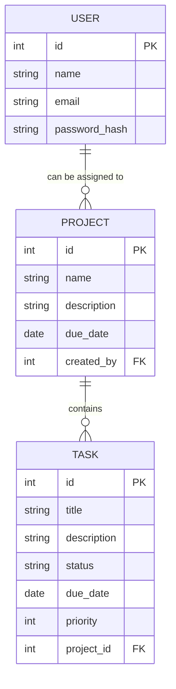

# Working Everywhere API

## Overview

The **Working Everywhere API** is a Laravel-based application designed to facilitate project and task management. It features a MySQL database for data storage and handles project assignments, task tracking, and user management.

## Prerequisites

1. **Docker**: Install Docker to run containers locally.
   - [Docker Installation Guide](https://docs.docker.com/get-docker/)

2. **Docker Compose**: Docker Compose simplifies multi-container configurations and is required to set up services.
   - [Docker Compose Installation Guide](https://docs.docker.com/compose/install/)

3. **Git** (optional): Useful for cloning the repository if not directly downloaded.

## Quick Start

1. **Clone the Repository**
   Download or clone the codebase from the repository:
   ```bash
   git clone https://github.com/michaelact/work-everywhere-api
   cd working-everywhere-api
   ```

2. **Build and Start the Containers**
   Use Docker Compose to build and start the services:
   ```bash
   docker compose up -d
   ```
   - The `database` service runs MySQL 8 with the necessary environment variables for database creation.
   - The `application` service runs the Laravel application, exposing the API on port 8000.

3. **Access the Application**
   Once the containers are up, access the API by navigating to http://localhost:8000 in a web browser or by using a tool like `curl` or Postman.

## Details

### Database Schema

The application’s database schema includes three primary tables: `USER`, `PROJECT`, and `TASK`. The relationships are defined as follows:

- **USER**: Stores user details such as ID, name, email, and password hash.
- **PROJECT**: Contains information about projects, including project name, description, and the user who created it.
- **TASK**: Manages task details, each associated with a specific project.


