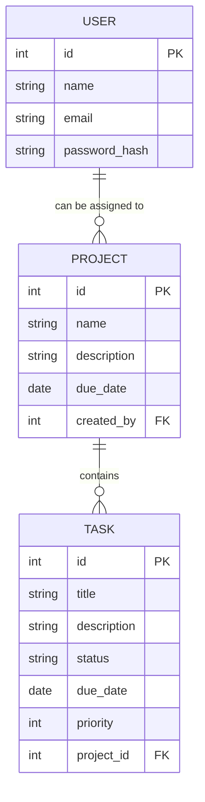

# Working Everywhere API

## Overview

## Prerequisites

## Quick Start

## Details

### Database Schema

```mermaid
erDiagram
    USER {
        int id PK
        string name
        string email
        string password_hash
    }

    PROJECT {
        int id PK
        string name
        string description
        date due_date
        int created_by FK
    }

    TASK {
        int id PK
        string title
        string description
        string status
        date due_date
        int priority
        int project_id FK
    }

    USER ||--o{ PROJECT : "can be assigned to"
    PROJECT ||--o{ TASK : "contains"
```
